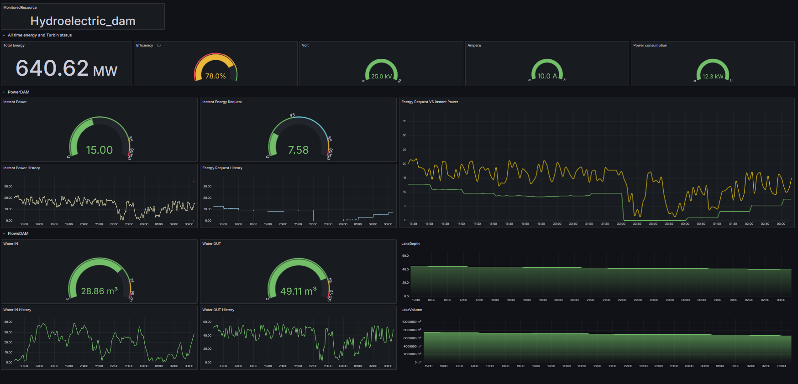
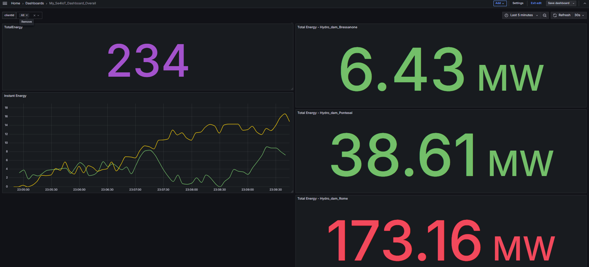

# A monitoring sytem for Hydroelectric Power plants

## Project Overview
This project implements an **hydroelectric power plant management system** using IoT technologies, MQTT, RabbitMQ, InfluxDB, MySQL, Node-RED, Grafana, and Telegraf. It simulates the behavior of a dam, monitors sensor data, evaluates performance, and generates alerts and reports based on predefined thresholds.

## Features
- **Sensor Simulation:** Simulates inflow, outflow, lake height, volume, energy demand, and turbine efficiency.
- **Dynamic Data Processing:** Aggregates sensor data into JSON format and publishes it via MQTT and RabbitMQ.
- **Real-Time Monitoring:** Displays sensor data on a customizable UI using Node-RED and Grafana.
- **Database Storage:** Stores data in InfluxDB (complete dataset) and MySQL (selected data for reports).
- **Alerting System:** Sends email notifications for alerts and generates summary reports.
- **Resilience and Failover:** Implements redundant Telegraf agents and supports failover mechanisms for MQTT and RabbitMQ.

## System Components
1. **IoT Sensors** - Simulate sensor readings for inflow, outflow, and turbine efficiency.
2. **Gateway** - Aggregates data and manages communication with brokers.
3. **Node-RED** - Acts as a middleware for data processing, visualization, and alerting.
4. **Grafana** - Provides visual dashboards for historical and real-time data.
5. **Databases** - Stores data in InfluxDB and MySQL for analysis and reporting.
6. **Telegraf Agents** - Handles MQTT and AMQP subscriptions and writes data to InfluxDB.

## Installation and Setup
1. **Clone the Repository:**
```
git clone https://github.com/oobooee/Univaq_Se4iot_Project.git
```
2. **(optional) Change some env paramiters in the .env file:**
```
CLIENT_ID = "Hydro_dam_Name"
MAX_HEIGHT = 60
MAX_VOLUME = 10000000
MAX_INFLOW = 30
MAX_OUTFLOW = 60
INITIAL_FILL_PERCENTAGE = 0.85
```
3. **(optional) Run multiple instances**
```
If you would run multiple instances of the environement (eg: a second remote indipendent monitoring systems),
change also those parameters on the .env file pointing the primary instance IP address od dns name.
Then run on a remote separate docker env.
You need some networking notions and port forwarding principles to accomplish this.

MQTT_BROKER = "my_se4iot_pr_mosquitto"
RABBIT_HOST = "my_se4iot_pr_rabbitmq"
INFLUX_HOST = "my_se4iot_pr_influxdb"
```
4. **Start Docker Containers:**
```
docker-compose up --build
```
5. **Solve some issue**
```
If you get a network overlapping error, change the ip address network in the docker-compose.yaml file or remove the network that overlaps.
docker network rm --force <in_use_network_name>
```
5. **Open grafana dashboards** 
```
use the url http://localhost:3000/login
with "admin"  "admin" password and confirm the new one.
```

## Configuration Details
- **MQTT Topics:** Defined in the `.env` file for dynamic subscriptions.
- **InfluxDB Setup:** Bucket and authorization token configured for data storage.
- **MySQL Schema:** Simplified table for storing summary data.
- **Alert Rules:** Configured in Node-RED and Grafana for email notifications.

## Testing Alerts and Reports
- Email alerts require configuration of SMTP settings in Node-RED and Grafana.
- Reports can be generated daily with summaries of key metrics.





